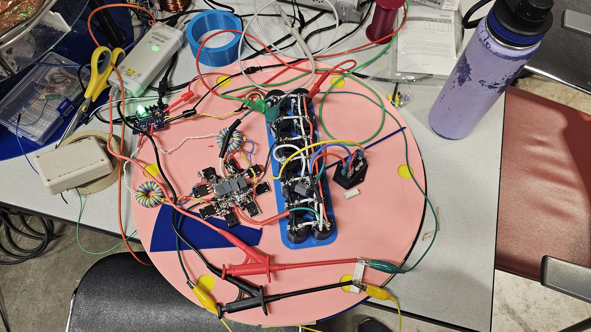
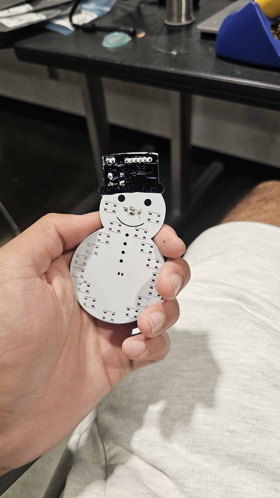
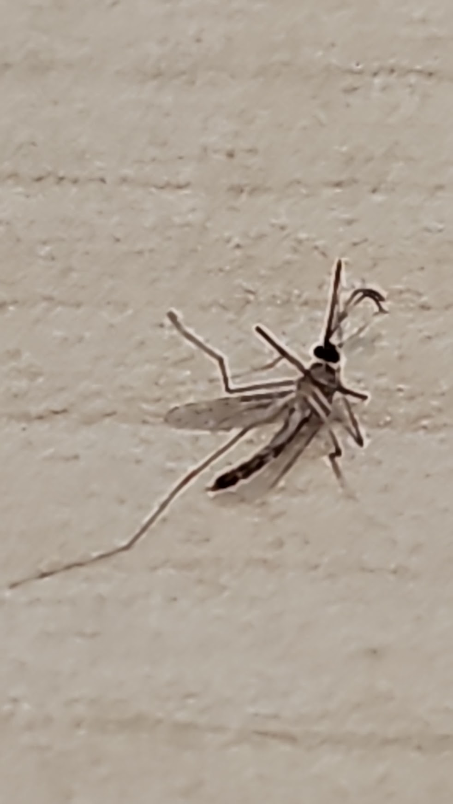
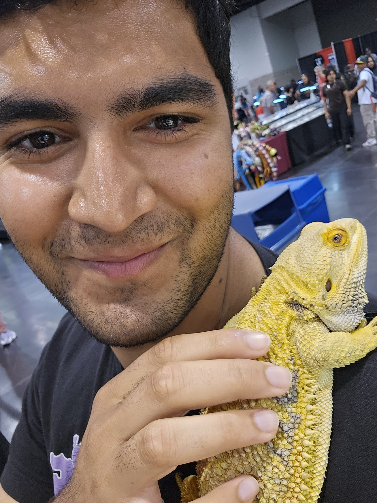
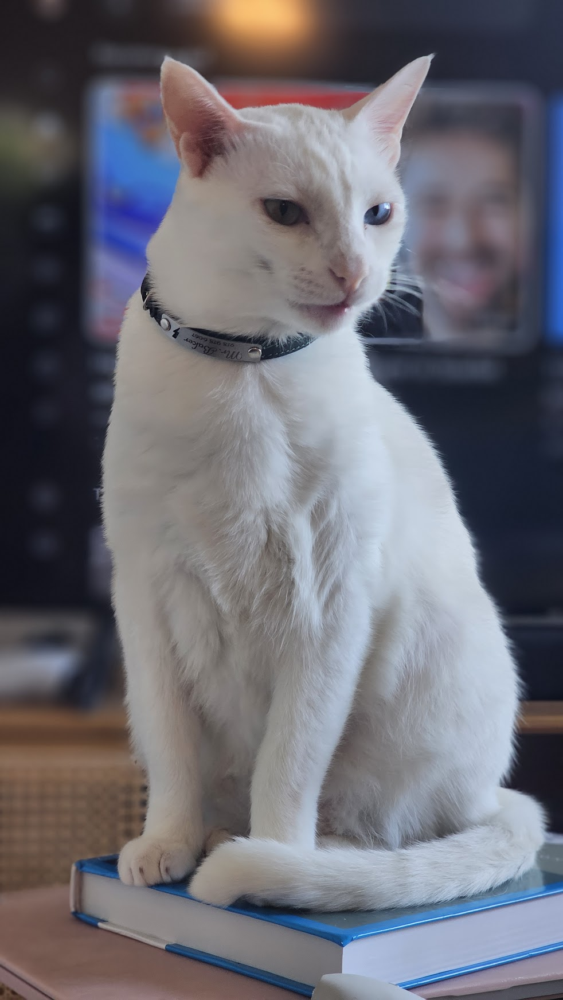

# Ello 🦇
###### v0.0.5™️

## About Me

I'm a third year Electrical Engineering student at UCLA. I like *most* things EE(not u, semiconductors), but I specialize in Signal Processing and Optimization. 

If you are looking to learn more about me, check out my [website](https://sanjitsarda.com/). I have *some* information about my projects there, but I never update that website properly, so you are better off looking at my [GitHub](https://github.com/Sanjit1).

I am happy to talk to people, so feel free to reach out. Also join [IEEE at UCLA](https://discord.gg/UHjbHfpw76), we are cool.

## Cool things I'll showcase here
Updated 12/2024
 - [Double Resonant Solid State Tesla Coil](https://hackaday.io/project/196356-drsstc-1)
 - [Neural Signal Processing for Motion](https://github.com/Sanjit1/NSP-ECE-189-Kao)
 - [Pulse Signal Estimation from Face Video](https://github.com/Sanjit1/PPG-ECE-189-Kadambi)
 - [Implicit Neural Models to Extract Pulse Signals from Videos](https://implicitppg.github.io/)

## Pictures I'll put here

 I am not affiliated with these robots lol.

